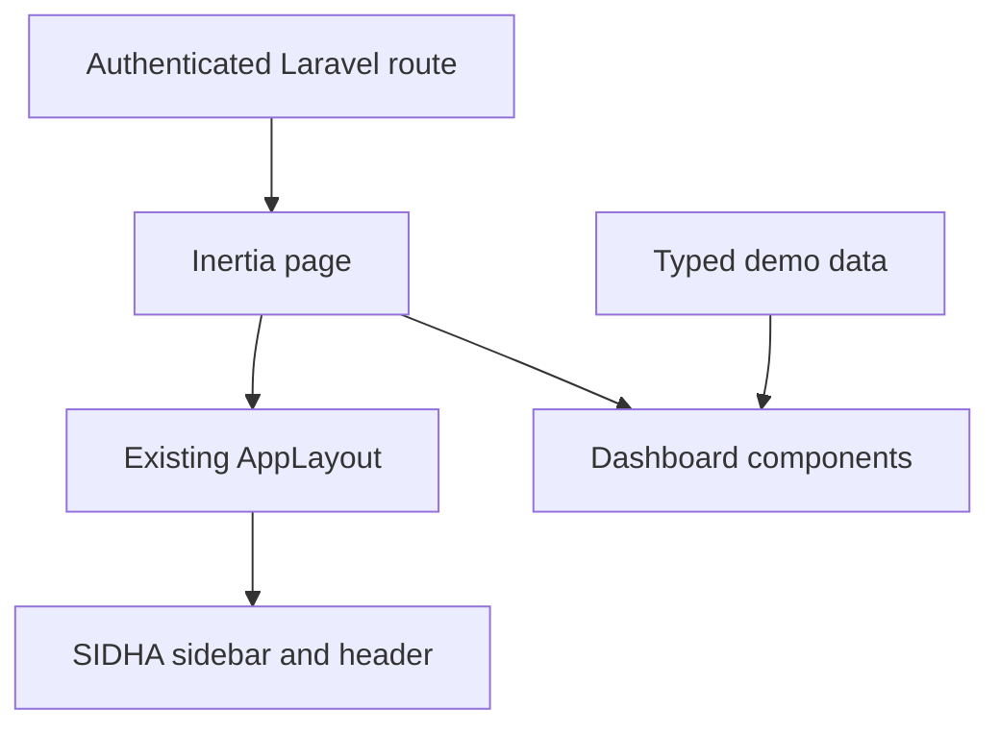

# SIDHA Phase 1 Shell and Dashboard Design

## Status

Approved in conversation on 2026-09-02. This document records the agreed design before implementation.

## Objective

Build the authenticated SIDHA application shell and a premium, responsive dashboard for an audiovisual production agency and recording studio. The phase is presentation-only: dashboard content is typed demonstration data, future modules use a generic `Coming soon` page, and the existing Laravel authentication and settings features remain intact.

## Existing Foundation

- Laravel 13 owns routing, authentication, middleware, and server-side tests.
- Inertia.js renders React 19 TypeScript pages without a separate API.
- Tailwind CSS 4 and the starter's Radix-based UI primitives provide styling and accessible interaction foundations.
- `AppLayout` selects the existing sidebar layout for authenticated pages.
- `SidebarProvider` already supplies responsive off-canvas behavior, desktop collapse, keyboard control, and cookie persistence.
- `useAppearance` already supports and persists `light`, `dark`, and `system` modes using `localStorage` and a cookie.
- Fortify authentication, passkeys, two-factor authentication, profile, security, and appearance settings are already working and covered by the foundation tests.

## Scope

### Included

- SIDHA visual tokens for light and dark modes.
- A branded, responsive application sidebar and header.
- Complete navigation for Dashboard, Projects, Studio, Clients, Calendar, SIDHA AI, Team, and Settings.
- A reusable `Coming soon` Inertia page for the six undeveloped product modules.
- A rich dashboard assembled from reusable React TypeScript components.
- Recharts area and donut charts.
- Typed demonstration data isolated from presentation components.
- Route, regression, type, lint, build, accessibility, responsive, and visual verification.

### Excluded

- Project, studio, client, calendar, AI, team, revenue, expense, budget, booking, activity, or notification persistence.
- New Eloquent models, controllers containing business behavior, form requests, policies, jobs, events, services, seeders, business migrations, or business tables.
- Search results, notification delivery, SIDHA AI behavior, project actions, or studio booking actions.
- Changes to authentication behavior or replacement of the existing settings pages.

## Architecture Decision

The phase extends the official starter shell instead of introducing a parallel `SidhaLayout`. Existing layout composition, responsive sidebar state, authenticated user access, and settings nesting remain the source of truth. New presentation components are small units with typed props and no direct dependency on Laravel models.

The dashboard imports one `dashboardDemoData` object from `resources/js/data/dashboard-demo.ts`. Later phases can replace that import with Inertia props shaped like `DashboardData` without rewriting the dashboard cards.



## Visual System

### Typography and Shape

- Keep the existing `Instrument Sans` font.
- Use 12 to 16 pixel radii for primary surfaces and 8 to 10 pixel radii for compact controls.
- Use subtle borders and low-opacity shadows instead of heavy outlines.
- Use short 150–220 ms transitions and disable non-essential motion when `prefers-reduced-motion` is active.

### Dark Theme

The dark theme is the signature SIDHA presentation. Reference colors are translated into the existing OKLCH semantic variables in `resources/css/app.css`.

| Token | Reference | Purpose |
|---|---:|---|
| Background | `#09080D` | Page canvas |
| Sidebar | `#0D0B12` | Navigation rail |
| Card | `#121019` | Standard surface |
| Elevated | `#181522` | Popovers and emphasized cards |
| Border | white at 8% | Quiet separation |
| Primary | `#8B5CF6` | Main accent |
| Electric accent | `#A855F7` | Highlights and chart gradient |
| Foreground | `#F7F5FF` | Primary text |
| Muted foreground | `#A39DAF` | Secondary text |

Purple glows are limited to selected navigation, chart emphasis, and the SIDHA AI card. The interface must remain professional rather than neon-heavy.

### Light Theme

| Token | Reference | Purpose |
|---|---:|---|
| Background | `#F7F6FA` | Page canvas |
| Sidebar | `#FBFAFD` | Navigation rail |
| Card | `#FFFFFF` | Standard surface |
| Border | `#E8E4EF` | Quiet separation |
| Primary | `#7C3AED` | Main accent |
| Foreground | `#17131F` | Primary text |
| Muted foreground | `#6F687A` | Secondary text |

Light and dark modes share dimensions, spacing, and information hierarchy. System mode continues to resolve through the existing appearance hook.

## Application Shell

### Sidebar

- Desktop expanded width: approximately 268 pixels.
- Desktop collapsed width: approximately 60 pixels.
- Mobile: use the existing `Sheet`-based sidebar.
- Preserve the starter's `sidebar_state` cookie and keyboard shortcut.
- Show a compact purple SIDHA symbol followed by `SIDHA` and `Creative Production` when expanded.
- Hide secondary brand copy, text labels, and the AI promotional card when collapsed; retain icon tooltips.

Navigation order and icon contract:

| Item | Lucide icon | Destination |
|---|---|---|
| Dashboard | `LayoutDashboard` | Existing `dashboard` route |
| Projects | `Clapperboard` | `projects.index`, generic page |
| Studio | `AudioLines` | `studio.index`, generic page |
| Clients | `UsersRound` | `clients.index`, generic page |
| Calendar | `CalendarDays` | `calendar.index`, generic page |
| SIDHA AI | `Sparkles` | `sidha-ai.index`, generic page with `AI` badge |
| Team | `Users` | `team.index`, generic page |
| Settings | `Settings` | Existing `profile.edit` route |

The selected item uses a translucent violet surface, violet indicator, and accessible foreground contrast. The sidebar footer contains a compact SIDHA AI promotional card with an `Open SIDHA AI` link followed by the existing authenticated `NavUser` control.

### Header

The header remains inside the authenticated shell and is sticky below the viewport top. It contains:

- sidebar trigger on mobile and desktop;
- current page title and optional description;
- a responsive presentational search field labelled `Search SIDHA`;
- a compact appearance menu with Light, Dark, and System choices;
- a notification icon with a demonstration unread indicator;
- no duplicate desktop profile control because the profile remains in the sidebar footer.

Search and notifications are deliberately presentational in this phase. They perform no request and expose no false result or notification workflow.

### Page Metadata

`AppLayout` continues accepting breadcrumbs for compatibility. The shell adds optional `title` and `description` metadata. If an explicit title is absent, the header uses the last breadcrumb. The generic page receives `title`, `description`, and `icon` props from its route and exposes the appropriate title to both the Inertia document head and shell header.

## Generic Coming Soon Pages

Projects, Studio, Clients, Calendar, SIDHA AI, and Team share one `resources/js/pages/coming-soon.tsx` page. Laravel defines six explicit, authenticated and verified routes that render this component with presentation props.

The page shows the module icon, module name, a short neutral description, and a `Coming soon` label. It includes no form, action, dataset, counter, business claim, or backend service. Settings is not routed to this page; it continues to use the starter's existing Profile, Security, and Appearance pages.

Guests are redirected to login for all six routes. Authenticated but unverified users remain subject to the same verification middleware as Dashboard.

## Dashboard Information Architecture

### Desktop Grid

The content area uses a 12-column grid:

1. Four KPI cards, each spanning three columns.
2. Revenue Overview spanning eight columns and Project Status spanning four.
3. Active Projects spanning seven columns and Upcoming Schedule spanning five.
4. Studio Bookings, Recent Activity, and Budget Overview, each spanning four columns.

Tablet layouts use two columns where space permits. Mobile layouts stack every card in a logical reading order and do not introduce horizontal page scrolling.

### KPI Values

| KPI | Demonstration value |
|---|---:|
| Revenue — This Month | 120,450 MAD |
| Expenses | 52,230 MAD |
| Estimated Profit | 68,220 MAD |
| Active Projects | 7 |

Each KPI card receives a label, formatted value, Lucide icon, semantic tone, and concise demonstration trend. Values are supplied as typed data rather than embedded in JSX.

### Revenue Overview

- Recharts responsive `AreaChart`.
- Six monthly points for revenue and expenses.
- Violet revenue gradient and a restrained secondary expense line.
- Accessible summary copy, grid, axes, and custom tooltip.
- Visual period control labelled `Last 6 months`; it does not query the backend.

### Project Status

- Recharts responsive `PieChart` rendered as a donut.
- Planning: 2 projects.
- Production: 3 projects.
- Post-production: 2 projects.
- Total `7` rendered at the center and repeated in text for non-visual access.

### Operational Cards

- **Active Projects:** four representative projects with client, stage, progress, deadline, budget label, and demonstration team initials.
- **Upcoming Schedule:** dated production, studio, and client events with time and location.
- **Studio Bookings:** room, artist or client, time range, and confirmed/pending status.
- **Recent Activity:** timestamped presentation-only events such as approval, upload, project creation, and booking.
- **Budget Overview:** total budget, used amount, remaining amount, percentage bar, and production/studio/post-production breakdown.

The information is credible enough to demonstrate layout behavior but is explicitly fictional and cannot be confused with persisted company records.

## Type and Data Contracts

`resources/js/types/dashboard.ts` defines `DashboardData` and focused child types for KPI, revenue point, project status, project summary, schedule item, booking, activity, and budget allocation. Identifiers are stable strings. Status and tone fields are string unions rather than arbitrary strings.

`resources/js/data/dashboard-demo.ts` exports exactly one readonly object:

```ts
export const dashboardDemoData: DashboardData = {
    kpis,
    revenue,
    projectStatus,
    activeProjects,
    upcomingSchedule,
    studioBookings,
    recentActivity,
    budget,
};
```

Dashboard components consume slices of this object through explicit props. They do not import `usePage`, access global variables, fetch data, or know whether future data originates from MySQL.

## Component Boundaries

```text
resources/js/
├── components/
│   ├── shell/
│   │   ├── appearance-menu.tsx
│   │   ├── header-search.tsx
│   │   └── sidha-ai-card.tsx
│   └── dashboard/
│       ├── dashboard-card.tsx
│       ├── dashboard-kpi-card.tsx
│       ├── revenue-overview.tsx
│       ├── project-status-chart.tsx
│       ├── active-projects.tsx
│       ├── upcoming-schedule.tsx
│       ├── studio-bookings.tsx
│       ├── recent-activity.tsx
│       └── budget-overview.tsx
├── data/
│   └── dashboard-demo.ts
├── pages/
│   ├── coming-soon.tsx
│   └── dashboard.tsx
└── types/
    └── dashboard.ts
```

`dashboard-card.tsx` standardizes card heading, optional description/action, surface, border, and padding. It does not contain section-specific behavior. Existing UI primitives remain in `components/ui` and are not duplicated.

## Responsive Behavior

| Viewport | Sidebar | Header | Dashboard |
|---|---|---|---|
| Under 768 px | Off-canvas sheet | Title, trigger, compact actions; search moves below or becomes compact | One column |
| 768–1279 px | Collapsible rail | Full title and compact search | Two-column cards where readable |
| 1280 px and above | Expanded by default | Full search and actions | Twelve-column composition |

Charts use `ResponsiveContainer`, cards use `min-width: 0`, long labels truncate where necessary, and the page must have no horizontal overflow at 375 pixels.

## Accessibility

- Preserve semantic landmarks: `aside`, `header`, `nav`, and `main`.
- Every icon-only control has an accessible name and visible focus state.
- Selected navigation exposes `aria-current="page"` through the Inertia link.
- Chart meaning is repeated in nearby text and is not encoded by color alone.
- Status badges meet contrast requirements in both themes.
- Sidebar, appearance menu, profile menu, and mobile sheet remain keyboard accessible.
- Decorative glows and icons are hidden from assistive technology where appropriate.

## Verification Strategy

### Automated

- Preserve all existing authentication and settings tests.
- Extend `DashboardTest` to assert the `dashboard` Inertia component and verify that no server-side business dataset is required.
- Add a feature test covering guest redirects and authenticated rendering for every generic module route, including exact component props.
- Run PHP formatting, PHPStan, TypeScript, frontend lint, and the production build.
- Run `php artisan migrate:status` and confirm the same five foundation migrations remain the complete migration set.

### Visual and Interaction

- Inspect Dashboard, Coming soon, and Settings at 1440 px, 1024 px, 768 px, and 375 px.
- Check Light, Dark, and System modes.
- Verify desktop collapse, mobile open/close, active navigation, appearance selection, user menu, settings navigation, and logout.
- Confirm search and notifications do not issue backend requests.
- Confirm charts resize without clipping and the page has no horizontal overflow.

## Acceptance Criteria

1. The authenticated shell matches the approved SIDHA navigation and premium audiovisual direction.
2. Dark mode uses the approved near-black surfaces and restrained electric-purple accents; light mode remains fully usable.
3. Dashboard displays all four KPI values and all seven requested content sections using typed demonstration data.
4. Recharts renders the Revenue Overview and Project Status charts responsively.
5. Six future module routes render the same generic Coming soon page; Settings retains the starter functionality.
6. No business model, table, migration, persistence, controller logic, search workflow, notification workflow, or AI behavior is added.
7. Authentication, email verification, profile, security, passkeys, two-factor authentication, appearance persistence, and logout continue to work.
8. The same five migrations remain, all existing tests pass, new route tests pass, and all quality/build checks exit successfully.
